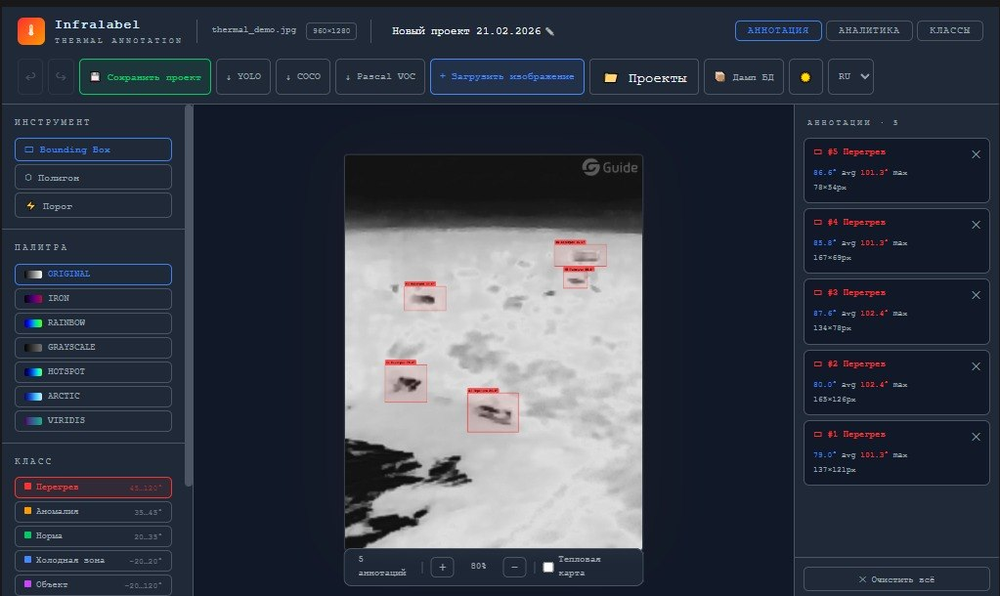
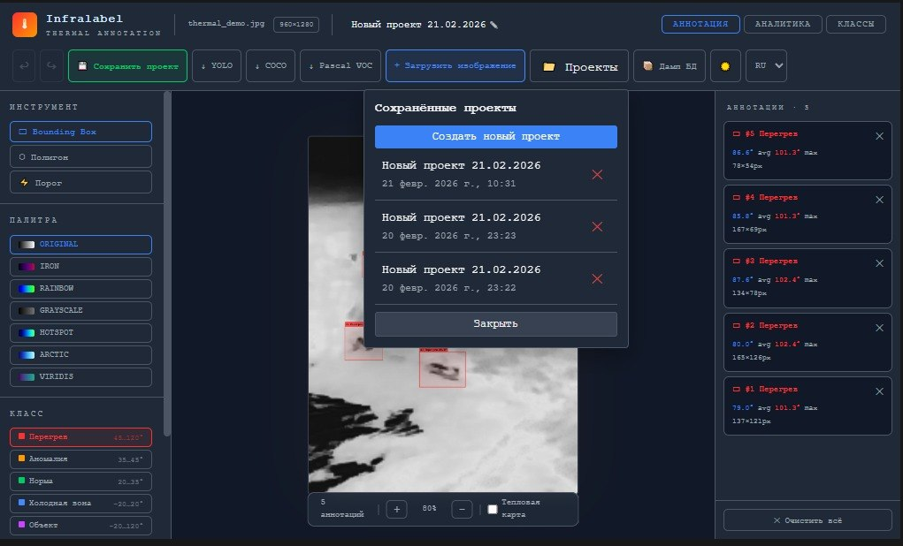
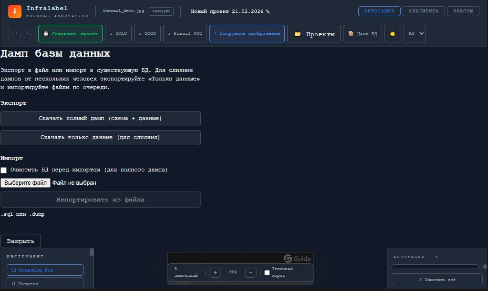
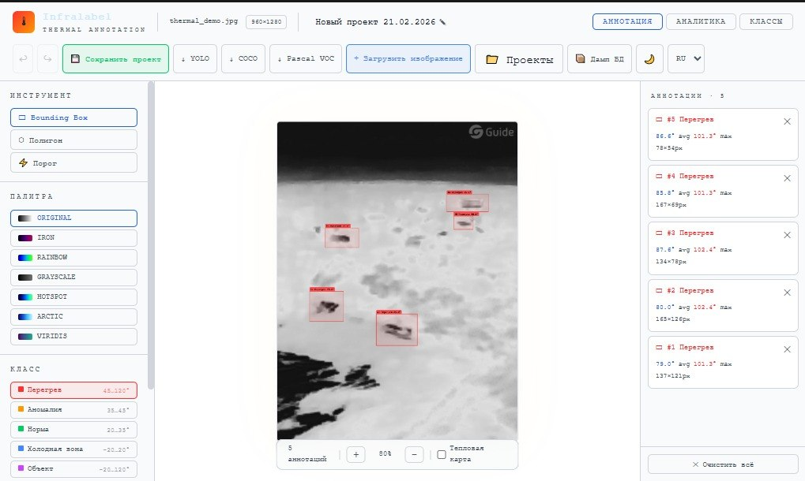
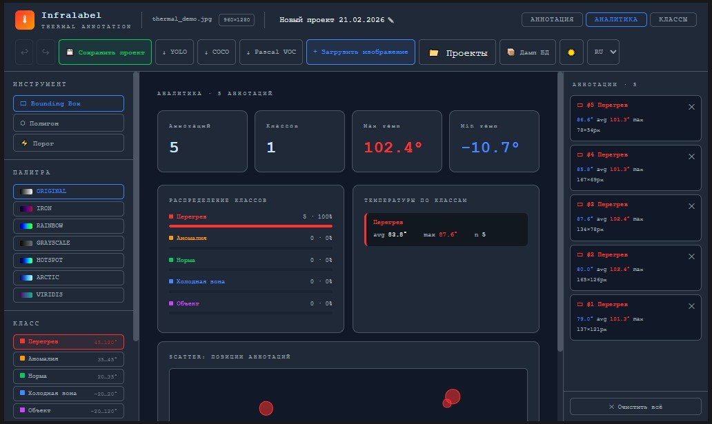
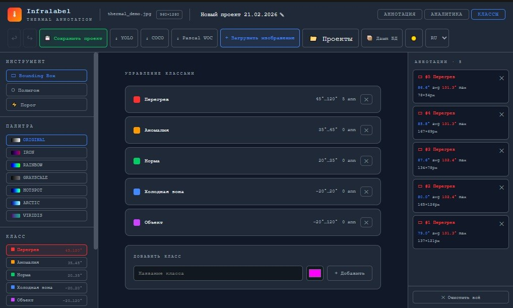

# ThermoLabel — документация

**Stable v1.0.0** · [Корневой README](../README.md)

Веб-приложение для аннотирования тепловых изображений (Docker, PostgreSQL). В интерфейсе может отображаться название **Infralabel** — это тот же продукт (брендинг UI).

---

## Скриншоты интерфейса

Галерея и подписи к файлам: **[`images/README.md`](images/README.md)**

| | |
|:---:|:---:|
|  |  |
|  |  |
|  |  |

Замените скриншоты в папке [`images/`](images/) при обновлении UI.

---

## Быстрый старт

- [**QUICKSTART.md**](./guides/QUICKSTART.md) — запуск через Docker
- [**USING_GUIDE.md**](./guides/USING_GUIDE.md) — работа с приложением

---

## Основная документация

- [**ARCHITECTURE.md**](./ARCHITECTURE.md) — архитектура backend/frontend
- [**STRUCTURE.md**](./STRUCTURE.md) — структура репозитория
- [**TESTING.md**](./TESTING.md) — тесты (pytest, Jest)
- [**ROADMAP.md**](./ROADMAP.md) — планы

---

## API

- [**API_EXAMPLES.md**](./api/API_EXAMPLES.md) — примеры запросов

Интерактивно: `http://localhost:8000/docs` после `docker compose up -d`.

---

## Архив отчётов (v0.3.0)

Исторические материалы:

- [FINAL_REPORT_v0.3.0.md](./reports/FINAL_REPORT_v0.3.0.md)
- [UPDATES_v0.3.0.md](./reports/UPDATES_v0.3.0.md)
- [STATISTICS_v0.3.0.md](./reports/STATISTICS_v0.3.0.md)
- [COMPLETION_REPORT.md](./reports/COMPLETION_REPORT.md)

Актуальное состояние продукта — в корневом [README](../README.md) и в этом файле (v1.0.0).

---

## Структура `docs/`

```
docs/
├── README.md              ← вы здесь
├── images/                ← скриншоты для README
├── guides/
├── reports/               ← архив v0.3.0
└── api/
```

---

**Версия документации:** 1.0.0  
**Репозиторий:** [github.com/C0deRonin/ThermoLabel](https://github.com/C0deRonin/ThermoLabel)
